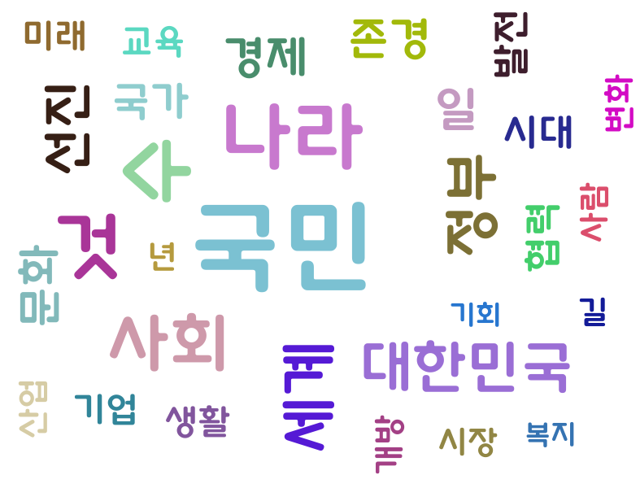
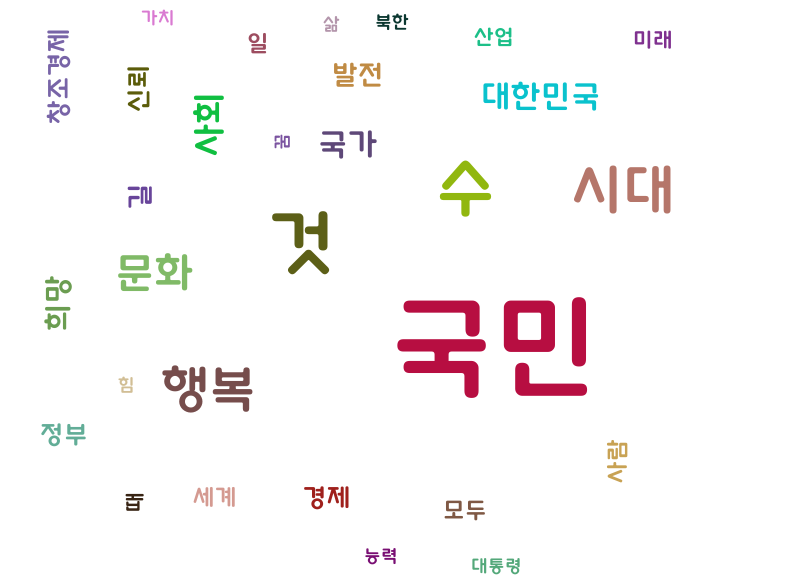
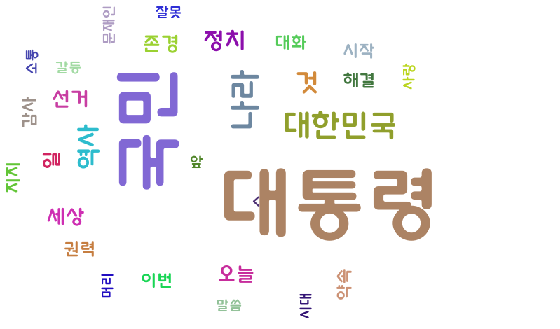

# WordCloud-with-KoNLPy
- pytagcloud, KoNLPy를 이용해서 word cloud 그리기
- 17,18,19대 대한민국 대통령 취임 연설을 분석합니다.

## 설명
- KoNLPy(Komoran)을 이용해서 명사 추출
- pytagcloud로 word cloud 생성

## 결과

1. 17대 대통령 취임사 word cloud

2. 18대 대통령 취임사

3. 19대 대통령 취임사 word cloud

- [발표자료](NLP%20with%20KoNLPy%20Presentation.pptx)
